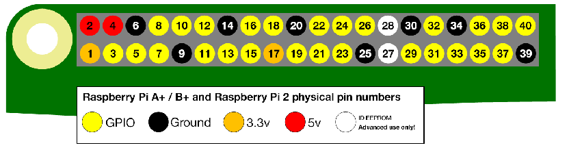

# Raspberry Pi Setup Guide

This guide provides instructions on how to set up your Raspberry Pi and connect various devices to the GPIO pins.

## Table of Contents

1. [Introduction](#introduction)
2. [Required Components](#required-components)
3. [GPIO Pin Layout](#gpio-pin-layout)
4. [Connecting Devices](#connecting-devices)
    - [Connecting the Motor](#connecting-the-motor)
    - [Connecting the RFID Reader](#connecting-the-rfid-reader)
    - [Connecting the Keypad](#connecting-the-keypad)
5. [Software Setup](#software-setup)

## Introduction

This guide will help you set up your Raspberry Pi and connect various devices to the GPIO pins. Follow the instructions carefully to ensure a successful setup.

## Required Components

- Raspberry Pi 4/5
- Stepper Motor with Controler
- RFID Reader (MFRC522)
- Keypad
- Jumper wires
- Breadboard (optional)

## GPIO Pin Layout



| Pin | Function | Pin | Function |
|-----|----------|-----|----------|
| 1   | 3V3      | 2   | 5V       |
| 3   | GPIO2    | 4   | 5V       |
| 5   | GPIO3    | 6   | GND      |
| 7   | GPIO4    | 8   | GPIO14   |
| 9   | GND      | 10  | GPIO15   |
| 11  | GPIO17   | 12  | GPIO18   |
| 13  | GPIO27   | 14  | GND      |
| 15  | GPIO22   | 16  | GPIO23   |
| 17  | 3V3      | 18  | GPIO24   |
| 19  | GPIO10   | 20  | GND      |
| 21  | GPIO9    | 22  | GPIO25   |
| 23  | GPIO11   | 24  | GPIO8    |
| 25  | GND      | 26  | GPIO7    |
| 27  | GPIO0    | 28  | GPIO1    |
| 29  | GPIO5    | 30  | GND      |
| 31  | GPIO6    | 32  | GPIO12   |
| 33  | GPIO13   | 34  | GND      |
| 35  | GPIO19   | 36  | GPIO16   |
| 37  | GPIO26   | 38  | GPIO20   |
| 39  | GND      | 40  | GPIO21   |


## Connecting Devices

### Connecting the Motor

Connect the motor to the following GPIO pins:

- Motor Pin 1 (IN1): GPIO6 (Pin 31)
- Motor Pin 2 (IN2): GPIO13 (Pin 33)
- Motor Pin 3 (IN3): GPIO19 (Pin 35)
- Motor Pin 4 (IN4): GPIO26 (Pin 37)

### Connecting the RFID Reader

Connect the RFID reader to the following GPIO pins:

- SDA: GPIO8 (Pin 24)
- SCK: GPIO11 (Pin 23)
- MOSI: GPIO10 (Pin 19)
- MISO: GPIO9 (Pin 21)
- IRQ: Not connected
- GND: GND (Pin 6)
- RST: GPIO25 (Pin 22)
- 3.3V: 3.3V (Pin 1)

### Connecting the Keypad

Connect the keypad to the following GPIO pins:

- Row 1: GPIO18 (Pin 12)
- Row 2: GPIO23 (Pin 16)
- Row 3: GPIO24 (Pin 18)
- Row 4: GPIO25 (Pin 22)
- Col 1: GPIO22 (Pin 15)
- Col 2: GPIO27 (Pin 13)
- Col 3: GPIO17 (Pin 11)
- Col 4: GPIO4 (Pin 7)

## Software Setup

1. Install the required libraries:
    ```bash
    sudo apt-get update && sudo apt upgrade
    sudo apt-get install python3-gpiozero
    sudo apt-get install python3-spidev
    pip3 install asyncio
    pip3 install websockets
    ```

2. Clone the project repository:
    ```bash
    git clone https://github.com/MaxKonze/RaspberryPi
    cd RaspberryPi/RaspberryPi
    ```

Follow these steps to ensure that your Raspberry Pi and connected devices are set up correctly.